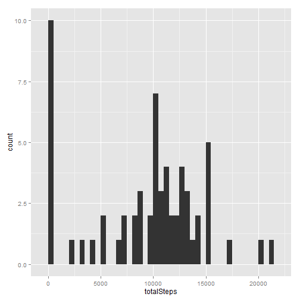
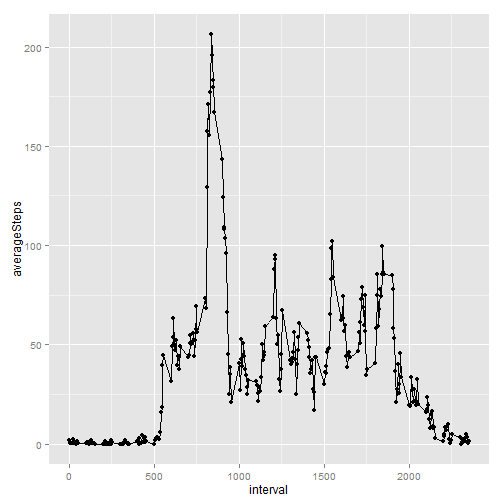
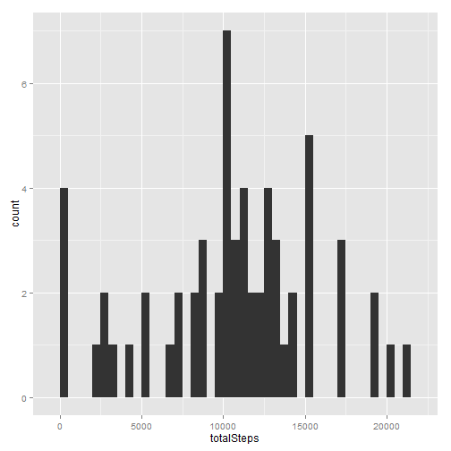
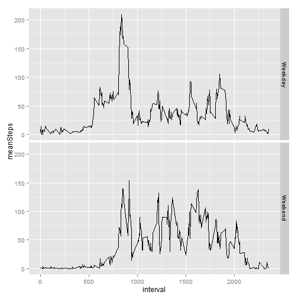

##Loading and Preprocessing The Data
Data was provided in the form of a .csv file. Loading the data into R is straightforward:


```r
setwd('d:/users/matthew/downloads')
activityData <- read.csv("activity.csv")
```

After loading the data, a quick look at summary statistics can help us get our bearings:


```r
summary(activityData)
```

```
##      steps                date          interval     
##  Min.   :  0.00   2012-10-01:  288   Min.   :   0.0  
##  1st Qu.:  0.00   2012-10-02:  288   1st Qu.: 588.8  
##  Median :  0.00   2012-10-03:  288   Median :1177.5  
##  Mean   : 37.38   2012-10-04:  288   Mean   :1177.5  
##  3rd Qu.: 12.00   2012-10-05:  288   3rd Qu.:1766.2  
##  Max.   :806.00   2012-10-06:  288   Max.   :2355.0  
##  NA's   :2304     (Other)   :15840
```

No further preprocessing was done on the data.

##What is the Mean Total Number of Steps Taken Per Day?

Calculating the average total number of steps per day is done in three steps:

1. Calculate the total number of steps taken per day.(Ignoring missing values)


```r
library(plyr)
totalStepsPerDay <- ddply(activityData, .(date), summarize, 
                          totalSteps=sum(steps, na.rm=TRUE))
```

2. Make a histogram of total number of steps taken each day.


```r
library(ggplot2)
ggplot(totalStepsPerDay, aes(x=totalSteps)) + geom_histogram(binwidth=500)
```

 

3. Calculate and report the mean and median of the total number of steps taken per day.


```r
median(totalStepsPerDay$totalSteps)
```

```
## [1] 10395
```

```r
mean(totalStepsPerDay$totalSteps)
```

```
## [1] 9354.23
```

##What is the Average Daily Activity Pattern?

1. Make a time series plot of the 5-minute interval and the average number of steps taken averaged across all days.


```r
averageStepsPerDay <- ddply(activityData, .(interval), summarize, 
                            averageSteps=mean(steps, na.rm=TRUE))
ggplot(averageStepsPerDay, aes(x=interval, y=averageSteps, group=1)) + 
                            geom_line() + geom_point()
```

 

2. Which 5-minute interval, on average across all days in the dataset, contains the maximum number of steps?


```r
maxStepsRow <- which.max(averageStepsPerDay$averageSteps)
averageStepsPerDay[maxStepsRow,]$interval
```

```
## [1] 835
```

##Imputing Missing Values

1. Calculate and report the total number of missing values in the dataset.


```r
sum(is.na(activityData$steps))
```

```
## [1] 2304
```

2. Devise a strategy for filling in all of the missing values in the dataset.

  I will calculate a mean for each (dayOfWeek, interval) that has a missing value and use that mean to replace the missing values.
  
3. Create a new dataset that is equal to the original dataset but with the missing data filled in.


```r
activityData$dateAsDate <- as.Date(activityData$date)
activityData$dayOfWeek <- weekdays(activityData$dateAsDate)

meanStepsByIntervalDayOfWeek <- ddply(activityData, c('interval', 'dayOfWeek'),
                                summarise, avgSteps = mean(steps, na.rm=TRUE))

activityData <- merge(activityData, meanStepsByIntervalDayOfWeek, by.x = c("dayOfWeek", "interval"), by.y = c("dayOfWeek", "interval"))

activityData$steps[is.na(activityData$steps)] <- activityData$avgSteps
```

```
## Warning in activityData$steps[is.na(activityData$steps)] <- activityData
## $avgSteps: number of items to replace is not a multiple of replacement
## length
```

4. Make a histogram of the total number of steps taken each day and calculate and report the mean and median total number of steps taken per day. Do these values differ from the estimates in the first part of the assignment? What is the impact of imputing missing data on the estimates of the total daily number of steps?


```r
totalStepsPerDayWithImputedNA <- ddply(activityData, .(date), summarize, 
                          totalSteps=sum(steps, na.rm=TRUE))
ggplot(totalStepsPerDayWithImputedNA, aes(x=totalSteps)) + geom_histogram(binwidth=500)
```

 

```r
median(totalStepsPerDayWithImputedNA$totalSteps)
```

```
## [1] 10765
```

```r
mean(totalStepsPerDayWithImputedNA$totalSteps)
```

```
## [1] 10654.04
```

##Are There Differences in Activity Patterns Between Weekdays and Weekends?

1. Create a new factor variable in the dataset with two levels - "weekday" and "weekend."


```r
activityData$weekPart <- activityData$dayOfWeek %in% c("Monday", "Tuesday", "Wednesday", "Thursday", "Friday")
activityData$weekPart <- replace(activityData$weekPart, activityData$weekPart == "FALSE", "Weekend")
activityData$weekPart <- replace(activityData$weekPart, activityData$weekPart == "TRUE", "Weekday")
```

2. Make a panel plot containing a time series plot (i.e. type = "l") of the 5-minute interval (x-axis) and the average number of steps taken, averaged across all weekday days or weekend days (y-axis). See the README file in the GitHub repository to see an example of what this plot should look like using simulated data


```r
averageStepsPerIntervalPerWeekPart <- ddply(activityData, c('interval', 'weekPart'), summarize, meanSteps = mean(steps))

ggplot(averageStepsPerIntervalPerWeekPart, aes(x=interval, y=meanSteps)) +
  geom_line() + facet_grid(weekPart ~ .)
```

 
